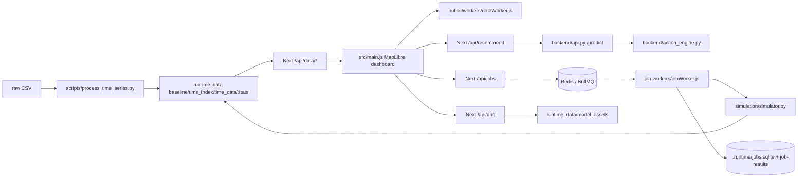

# 1. Repository identity

- Repo folder path observed by `pwd`: `/home/rami/Desktop/Projects/odc`.
- Invocation path: `/home/rami/Desktop/Github/Projects/odc`. Inference: this is likely a symlink or bind path to the observed working tree.
- Detectable repo/package name: `odc-viz` from `package.json`; product name is NetVision Digital Twin.
- Current branch: `main`.
- Current commit: `7c9ee67e417c51a0c36fee4acab7d5e68e2acb7e` (`Merge pull request #8 from yassinekolsi/prototype-v1`, 2026-04-20).
- Remotes: `origin` -> `https://github.com/yassinekolsi/odc.git`; `target` -> `https://github.com/Rami-Troudi/tunisia-network-command.git`.
- Local branches: `main`.
- Remote branches: `origin/main`, `origin/HEAD -> origin/main`, `target/main`, `target/HEAD -> target/main`.
- Working tree status before audit output creation: clean source tree; ignored generated folders present.
- Untracked/ignored generated files present: `.runtime/`, `.venv/`, `backend/__pycache__/`, `simulation/__pycache__/`, `runtime_data/`.
- Tracked generated files: none under `runtime_data/`, `.runtime/`, `.next/`, or `node_modules/`.

Branch analysis:

| Branch | Latest commit | Relation to `main` | Files changed vs `main` | Likely purpose | Status |
|---|---:|---|---|---|---|
| `main` | `7c9ee67 Merge pull request #8 from yassinekolsi/prototype-v1` | current branch; equal to `origin/main` | none | Current upstream production/demo branch | Production-relevant but currently fragile |
| `origin/main` | `7c9ee67 Merge pull request #8 from yassinekolsi/prototype-v1` | `0 ahead / 0 behind` current branch | none | Upstream canonical branch | Current |
| `target/main` | `6ac6fbc Snapshot mirror of odc into tunisia-network-command` | unrelated/snapshot style; `main...target/main` reports `58 / 1` | large diff: adds forecast route/scripts/model, adds `pages/site-planning.js`, renames `job-workers/` to `workers/`, removes current `recommend-context` and `recommendations-export`, deletes `backend/core_rules.py` | Mirror/snapshot into a different repo, possibly older or alternate demo line | Production-relevance unclear; do not merge blindly |

# 2. High-level solution summary

NetVision is a telecom radio-network digital twin and NOC console. It loads cell/site baseline data and timestamped KPI slices, renders 4G/LTE cells and sectors on a MapLibre map, highlights congestion and low-CQI conditions, recommends remediation actions through a Python rule engine, and simulates selected actions through a Python simulator. Main users are NOC operators, RF optimization engineers, and demo/product stakeholders reviewing congestion, lost traffic, peak hours, drift, and action impact.

The main workflow is: generate `runtime_data` from raw CSV, start Redis, start the FastAPI recommendation backend, start the BullMQ worker, start Next.js, open the dashboard, inspect cells/sites, optionally import CSV sessions, request recommendations, run simulations, and export recommendation CSV/report output.

Currently implemented in `main`: Next.js dashboard, MapLibre/Chart.js UI, static runtime data loading through Next API routes, CSV import in a browser worker, FastAPI recommendation API, deterministic action engine, Python simulator, BullMQ/Redis async simulation jobs, peak-hour API, drift API shell, and CSV export proxy.

Planned or incomplete: forecast generation is absent from current `main` despite branch history showing forecast assets on `target/main`; drift requires model validation artifacts not present locally; backend recommendation startup is currently broken by missing constants in `backend/core_rules.py`; validation still expects removed model artifact files and older French action labels.

# 3. Full architecture overview

Layers:

- Frontend dashboard: `pages/index.js` injects a static HTML shell; `src/main.js` owns app state, MapLibre setup, timeline, filters, modals, recommendations, simulation calls, imports, exports, charts, and notifications; `src/style.css` styles the console.
- Browser worker: `public/workers/dataWorker.js` performs CPU-heavy CSV parsing, field inference, import transformations, feature update calculation, and chart aggregation.
- Next.js API routes: secure data file serving, recommendation proxy, recommendation-context upload/reset proxy, recommendation export proxy, direct simulation route, async job creation/status, drift, and peak-hours.
- Python FastAPI backend: `backend/api.py` loads a runtime/uploaded context, exposes `/predict`, `/cells`, `/context/upload`, `/recommendations/export`, and related endpoints.
- Rule/action engine: `backend/action_engine.py` normalizes runtime/imported data, builds busy-hour profiles, scores neighbors, ranks actions, and emits recommendation payloads.
- Simulation engine: `simulation/simulator.py` loads baseline and a time slice, applies fast deterministic action models, and returns before/after KPI JSON.
- Async jobs: `pages/api/_lib/jobs.js`, `pages/api/jobs/*`, and `job-workers/jobWorker.js` coordinate SQLite job records and BullMQ jobs over Redis.
- Runtime data: generated `runtime_data/*.json` and `runtime_data/time_data/*.parquet` feed frontend, backend, and simulator. `.runtime/jobs.sqlite` stores async job lifecycle.

# 4. Repository structure

- `pages/`: Next.js Pages Router entrypoints. `pages/index.js` provides the dashboard DOM shell; `pages/_app.js` and `_document.js` wrap the app; `pages/api/` contains all Node API endpoints.
- `src/`: frontend runtime logic and CSS. `src/main.js` is the primary client application. `src/utils/` contains timestamp parsing and feature update normalization helpers.
- `public/workers/`: browser worker for data and import transformations.
- `backend/`: FastAPI API, deterministic action engine, shared KPI constants, helpers, and validation script.
- `simulation/`: Python CLI simulator used by both direct and async simulation flows.
- `scripts/`: CSV-to-runtime-data processing pipeline.
- `job-workers/`: BullMQ worker process launched by `npm run worker`.
- `runtime_data/`: ignored/generated local runtime dataset. Present locally but not tracked.
- `.runtime/`: ignored/generated local SQLite job database and expected job result artifacts.
- `assets/`: hackathon/reference text artifacts, not runtime code.
- `docker-compose.yml`: Redis service for local queue/cache.
- `start.ps1`: Windows-oriented local orchestration script.

Important files:

- `package.json`: Node engine, scripts, and frontend/worker dependencies.
- `requirements.txt`: Python backend/pipeline/simulator dependencies.
- `backend/core_rules.py`: intended single source of KPI thresholds and recovery rates.
- `backend/action_engine.py`: primary recommendation logic, but currently imports constants missing from `core_rules.py`.
- `pages/api/_lib/security.js`: token auth and in-memory rate limiting.
- `pages/api/_lib/jobs.js`: SQLite schema and BullMQ producer support.
- `README.md`: quickstart and architecture notes, with several mismatches noted below.

# 5. Build and runtime

Node requirements:

- `package.json` requires Node `>=22.5.0`.
- Local observed Node: `v25.8.0`; npm: `11.11.0`.
- `node_modules/` is absent locally, so Next.js runtime/build was not executed in this audit.

npm scripts:

- `npm run dev`: `next dev`.
- `npm run worker`: `node job-workers/jobWorker.js`.
- `npm run build`: `next build`.
- `npm start`: `next start`.
- `npm run lint`: `next lint`.

Python:

- `requirements.txt` pins FastAPI, uvicorn, pydantic, pandas, numpy, duckdb, pyarrow, joblib, scikit-learn, matplotlib, requests, redis.
- System Python observed: `3.13.11`, missing `duckdb`.
- Local `.venv` observed: Python `3.14.3`, includes enough dependencies to import `simulation.simulator`, but `backend.action_engine` fails due missing constants.

Required services:

- Redis at `redis://127.0.0.1:6379` for BullMQ worker and backend export cache. `docker-compose.yml` starts `redis:7-alpine`.
- FastAPI backend on `http://127.0.0.1:8000` by default.
- Next.js on `http://localhost:3000`.

Detected startup commands:

- Frontend: `npm run dev`.
- Worker: `npm run worker`.
- Backend: `python run_backend.py` or `uvicorn backend.api:app --host 0.0.0.0 --port 8000` by code.
- Backend with validation: `python run_backend.py --validate`.
- Data processing: `python scripts/process_time_series.py --input data/data_set_radio_1.csv --output runtime_data`.

Clean-clone order expected:

1. `npm install`.
2. `python -m pip install -r requirements.txt`.
3. Provide raw CSV files; README references `data/data_set_radio_1.csv`, while script defaults are root-level `data_set_radio_1.csv` and `data_set_radio_all_hour.csv`.
4. Run `python scripts/process_time_series.py --input ... --output runtime_data`.
5. Start Redis with `docker-compose up -d`.
6. Start FastAPI with `python run_backend.py`.
7. Start worker with `npm run worker`.
8. Start frontend with `npm run dev`.

Current blocker: FastAPI cannot start until `backend/action_engine.py` imports are fixed.

# 6. Environment variables

| Name | File(s) | Default | Purpose | Required | Sensitive | Missing behavior |
|---|---|---|---|---|---|---|
| `API_AUTH_TOKEN` | `pages/api/_lib/security.js` | none | Preferred API token | Production yes | Yes | If no auth token and production without bypass, API returns 401 |
| `API_TOKEN` | `pages/api/_lib/security.js` | none | Alternate API token | Production yes | Yes | Same as above |
| `AUTH_TOKEN` | `pages/api/_lib/security.js` | none | Alternate API token | Production yes | Yes | Same as above |
| `SESSION_TOKEN` | `pages/api/_lib/security.js` | none | Alternate API token | Production yes | Yes | Same as above |
| `AUTH_BYPASS` | `pages/api/_lib/security.js`, `start.ps1` | `false` unless set | Explicit local auth bypass | Optional | No | In non-production, auth bypasses even when unset; in production, must be true to bypass |
| `NODE_ENV` | `pages/api/_lib/security.js` | set by Node/Next | Dev/prod auth behavior | Optional | No | Non-production bypasses auth if token absent |
| `BACKEND_API_URL` | `pages/api/recommend.js`, `recommend-context.js`, `recommendations-export.js` | `http://127.0.0.1:8000` | FastAPI base URL | Optional | No | Uses localhost backend |
| `BACKEND_API_TIMEOUT_MS` | same proxy routes | `15000`, `30000`, or `420000` by route | Backend fetch timeout | Optional | No | Route-specific default used |
| `BACKEND_API_RETRY_ATTEMPTS` | `pages/api/recommendations-export.js` | `3` | CSV export retry count | Optional | No | 3 attempts |
| `BACKEND_API_RETRY_DELAY_MS` | `pages/api/recommendations-export.js` | `1500` | CSV export retry backoff | Optional | No | 1.5s base delay |
| `REDIS_URL` | `pages/api/_lib/jobs.js`, `job-workers/jobWorker.js`, `backend/api.py` | `redis://127.0.0.1:6379` | BullMQ and export cache Redis | Optional for backend cache, required for async jobs | No unless credentialed URL | Async jobs fail/enqueue 503 if Redis unavailable; backend falls back to in-memory export cache |
| `JOB_QUEUE_NAME` | `pages/api/_lib/jobs.js`, `job-workers/jobWorker.js` | `netvision-jobs` | BullMQ queue name | Optional | No | Producer/worker must match |
| `JOB_WORKER_CONCURRENCY` | `job-workers/jobWorker.js` | `2` | Worker concurrency | Optional | No | Defaults to 2 |
| `DRIFT_ABS_PRB_THRESHOLD` | `pages/api/drift.js` | `15` | Absolute PRB drift alert threshold | Optional | No | Default threshold |
| `DRIFT_PCT_PRB_THRESHOLD` | `pages/api/drift.js` | `30` | Percent PRB drift alert threshold | Optional | No | Default threshold |

No `.env*` files were found. No secret values were printed.

# 7. Frontend architecture

Mounting:

- `pages/index.js` defines `pageMarkup`, returns it through React with `dangerouslySetInnerHTML`, loads Material Symbols fonts and CSS, and imports `src/main.js` for imperative browser behavior.
- The UI is not componentized React; React is mainly a shell for a static operational console.

`src/main.js`:

- Holds a single `state` object for baseline data, time index, current observations, map, filters, layers, charts, selected site/cell, custom import session, peak hours, drift alerts, and cached recommendations.
- Initializes by fetching `/api/data/baseline.json`, `/api/data/time_index.json`, and `/api/data/stats.json`; then loads peak hours; builds hierarchy and features; loads the first time slice; initializes MapLibre.
- Uses MapLibre sources/layers for sectors, cells, labels, heatmap, congested rings, and site markers.
- Uses Turf `destination()` to build sector polygons from center, azimuth, radius, beamwidth, and arc-step resolution.
- Calculates sector radius from frequency band and optional Timing Advance (`TA_TO_METERS = 78`, radius clamped 150-2000m).
- Maintains feature-state cache for performant cell color/opacity/load/congested updates.

Timeline:

- `state.timeIndex` is sorted by parsed timestamp.
- `unifiedTimeline` controls slider/playback.
- `loadUnifiedTimeSlice()` aborts older requests, loads either custom session slices or `/api/data/time_data/<filename>`, updates observations, worker-derived feature updates, stats, alerts, map data, and selected site info.
- Playback reduces sector arc resolution for performance, then restores it on stop.

KPI updates:

- `updateFeaturesForTime()` calls the browser worker action `buildFeatureUpdates`.
- `applyWorkerFeatureUpdates()` updates point and sector properties, then syncs dynamic sector geometry and feature-state.

Alerts, filters, search, layers, charts:

- Filters cover status, bands, issue types, load range, severity range, and low-CQI-only mode.
- Search scans point features and site hierarchy, capped at 50 results.
- Alerts render congested cells; drift alerts render `/api/drift` results.
- Chart.js powers network summary, analytics modal, exploration modal, and before/after simulation charts.
- Basemap switch uses raster tile source `setTiles`; MapLibre controls and popups are imperative.

Recommendations and simulations:

- `renderRecommendationsPanel()` calls `/api/recommend`, maps backend action labels to simulator action keys, caches by `cell::mode::timeIndex`, and renders simulation buttons.
- `runSimulation()` enqueues `/api/jobs` and polls `/api/jobs/:id`.
- `runSitePlanningSimulation()` still calls `/api/simulate` directly for `new_site`, making it different from the normal queued simulation flow.

Import/export:

- CSV import is browser-local: file read -> worker `parseCsvPreview` -> mapping UI/profile -> worker `applyCsvMapping` -> custom dataset session.
- Imported datasets can be synced to FastAPI via `/api/recommend-context` if size caps pass.
- Export JSON downloads current features. CSV export calls `/api/recommendations-export`, then optionally filters CSV in the worker. Simple report is a local text summary.

Major frontend functions/classes:

- `init()`: full dashboard bootstrap.
- `initMap()`, `addMapLayers()`, `setupMapInteractions()`: map lifecycle.
- `buildFeaturesForTime()`, `updateFeaturesForTime()`, `applyWorkerFeatureUpdates()`: GeoJSON and KPI state.
- `loadUnifiedTimeSliceInternal()`, `loadHistoricalSliceInternal()`: timeline data loading.
- `renderRecommendationsPanel()`, `fetchBackendDecision()`, `syncRecommendationContextToBackend()`: recommendation flow.
- `runSimulation()`, `runSitePlanningSimulation()`, `displaySimulationResults()`: simulation flow.
- `applyImportedDataset()`, `restoreLiveDatasetSession()`, `confirmCsvImport()`: import session flow.

# 8. Next.js API architecture

| Route | Methods | File | Purpose | Input | Output | Dependencies | Auth/rate limit | Sync/async | Status |
|---|---|---|---|---|---|---|---|---|---|
| `/api/data/[...slug]` | GET | `pages/api/data/[...slug].js` | Path-restricted runtime data server | URL slug for `baseline.json`, `time_index.json`, `stats.json`, or `time_data/*.json|*.parquet` | JSON file stream or normalized Parquet `{timestamp, stats, observations}` | `runtime_data`, `parquetjs-lite` | Auth required; no explicit rate limit | Sync response, async file/parquet I/O | Primary |
| `/api/simulate` | POST | `pages/api/simulate.js` | Direct Python simulation | `{cell_name, action, params, time_entry, mode}` | Simulator JSON | `simulation/simulator.py`, `runtime_data` | Auth + 10/min/IP | Spawns Python per request | Primary for site planning, fallback/legacy vs queued flow |
| `/api/recommend` | POST | `pages/api/recommend.js` | Proxy to FastAPI `/predict` | `{cell_name, prb_load?, throughput?, active_users?, rrc_users?, cqi?, timestamp?}` | Backend recommendation payload | FastAPI backend | Auth + 30/min/IP | Async HTTP proxy | Primary |
| `/api/recommend-context` | POST, DELETE | `pages/api/recommend-context.js` | Upload/reset active imported context in FastAPI | POST `{baseline, slices, source?}` | `{success, cells, observations, busy_hour_profiles, updated_at}` | FastAPI backend | Auth + 10/min/IP | Async HTTP proxy | Primary for imports |
| `/api/recommendations-export` | GET | `pages/api/recommendations-export.js` | CSV export proxy | optional `timestamp` query | CSV passthrough | FastAPI `/recommendations/export` | Auth + 30/min/IP | Async HTTP proxy with retry | Primary export |
| `/api/drift` | GET | `pages/api/drift.js` | Drift alert computation from validation predictions | `abs_threshold?`, `pct_threshold?`, `limit?` | `{generated_at, source, thresholds, total_cells, alert_cells, alerts}` | `runtime_data/model_assets/val_predictions.parquet` | Auth + 20/min/IP | Reads/caches Parquet | Partial; local asset missing |
| `/api/peak-hours` | GET | `pages/api/peak-hours.js` | Per-cell peak PRB hour | `refresh?`, `cell?`, `limit?` | `{generated_at, source, total_cells, rows}` | `runtime_data/time_index.json`, `time_data/*.parquet`, writes generated peak files | Auth + 20/min/IP | Computes and writes cache | Primary, but writes into generated data |
| `/api/jobs` | POST | `pages/api/jobs/index.js` | Create async simulation job | same as simulate plus `job_type` | `202 {jobId,type,status}` | SQLite `.runtime/jobs.sqlite`, BullMQ, Redis | Auth + 20/min/IP | Async queue producer | Primary queued simulation |
| `/api/jobs/[id]` | GET | `pages/api/jobs/[id].js` | Poll async job | job id path | status/result/error | SQLite and optional job artifact | Auth + 120/min/IP | Sync DB read | Primary |

Security helpers:

- `_lib/security.js` checks token from bearer/header/cookie against configured env tokens. If no configured token, non-production bypasses auth; production fails closed unless `AUTH_BYPASS=true`.
- `_lib/security.js` rate limits in memory by client IP. This is process-local and not multi-instance safe.

Job helpers:

- `_lib/jobs.js` creates `.runtime/`, `.runtime/job-results/`, and SQLite `jobs` table; creates BullMQ `Queue` with Redis; formats job API responses and reads artifacts.

Failure modes:

- Data route returns 400 for disallowed paths, 404 for missing files, 500 for Parquet decode errors.
- Simulate returns 400 for invalid action/time filename, 503 for missing whitelist, 500 for Python failures.
- Recommendation/export/context routes return 502 when backend is unreachable.
- Drift returns 500 when `runtime_data/model_assets/val_predictions.parquet` is missing.
- Jobs return 503 if Redis queue is unavailable; job worker writes failed status on execution errors.

# 9. Python backend architecture

FastAPI app:

- `backend/api.py` defines `app = FastAPI(title="4G RAN Congestion API", lifespan=lifespan)`.
- Lifespan imports `backend.action_engine`, builds runtime context from `runtime_data`, and stores `runtime_context`, `active_context`, and `context_source` on `app.state`.
- Endpoints: `/health`, `/cells`, `/context/upload`, `/context/reset`, `/predict`, `/recommendations/summary`, `/recommendations/export`, `/cell/{cellname}/history`.

Required assets:

- Runtime recommendations require `runtime_data/baseline.json`, `runtime_data/time_index.json`, and `runtime_data/time_data/`.
- If missing, action engine returns an empty context rather than failing.
- Current code-level blocker: `backend/action_engine.py` imports `SITE_SATURATION_CELL_RATIO` and `SITE_SATURATION_MIN_DAYS`, but `backend/core_rules.py` does not define them. With local `.venv`, import fails before app startup.

Action engine:

- Input state fields: baseline `cell_name`, `enodeb_name`, `longitude`, `latitude`, `azimuth`, `frequency_band`, `localcell_id`, `cell_fdd_tdd_indication`; observations `timestamp`, `date_iso`, `hour`, `prb_load`, `throughput_kbps`, `active_users`, `rrc_users`, `cqi`, `traffic_volume_gb`, `ta`, `signal_power`, plus metadata.
- It normalizes both runtime files and uploaded frontend context into DataFrames.
- Recommendation rules: confirm congestion from PRB/throughput/active users/severity; detect busy hours; score neighbors; find underloaded same-site capacity peers; detect site-wide saturation; select actions by priority.
- Supported output actions in current action engine: `Load Rebalancing`, `Actions on Neighbors`, `Add Band`, `Tilt Adjustment`, `Add Sector`, `Add Site`, `Check Coverage/Interference`, `No Action Required`.
- Ranking: `ACTION_ORDER` orders short-term actions before CAPEX and `No Action Required`.
- Output shape: `{cellname, enodeb_name, frequency_band, date, hour, current_kpis, current_loss, predicted_next_hour, is_congested, busy_hour_flag, busy_hours, congested_busy_hours, structural_congestion, top_neighbors, top_neighbor_for_rebalancing, congestion_trigger, estimated_lost_ue, estimated_lost_gb, estimated_gain_ue, estimated_gain_gb, recommended_actions}`.

Additional fragility:

- `RECOVERY_RATES` in `core_rules.py` lacks keys used by `action_engine.py`: `actions_on_neighbors`, `add_band`, and `check_coverage`. After fixing the missing constants, some recommendation paths can still raise `KeyError`.

# 10. Data pipelines

`scripts/process_time_series.py`:

- Purpose: convert raw radio KPI CSV into `runtime_data`.
- CLI: `--input` one or more CSV files; default root files `data_set_radio_1.csv data_set_radio_all_hour.csv`. `--output` default `runtime_data`.
- Inputs: CSV with lowercased columns including `cell_name`, `date`, optional `time`, geometry columns, band/local cell IDs, PRB, throughput, CQI, active users, RRC users, TA, signal power, and traffic volume.
- Outputs: `baseline.json`, `time_index.json`, `stats.json`, and `time_data/<timestamp>.parquet`.
- Important functions: `load_data`, `parse_numeric`, `analyze_cell`, `write_parquet_slice`, `process_time_series_data`.
- Transformations: normalize numeric values including decimal comma; backfill static metadata by cell; filter invalid coordinates; parse dates; build baseline; analyze each cell for congestion/severity/health; write one Parquet slice per timestamp.
- Failure modes: no input files; missing geometry/date columns; no valid timestamps; missing Python deps; Unicode console output may be Windows-sensitive.

`backend/validate_pipeline.py`:

- Purpose: validation of older model/recommendation artifact pipeline.
- CLI: script entry only.
- Inputs expected under `runtime_data/model_assets`: `features_engineered.parquet`, `features_meta.json`, `val_predictions.parquet`, `all_cell_recommendations.parquet`, `cell_congestion_profile.parquet`.
- Outputs: `runtime_data/validation_report.txt`.
- Current status: mostly stale against current `main`; local `runtime_data/model_assets` is missing and current action labels differ.

Full raw CSV to dashboard flow:

1. Raw CSV is loaded by `process_time_series.py`.
2. Static cell data becomes `runtime_data/baseline.json`.
3. Each timestamp becomes a Parquet slice under `runtime_data/time_data/`.
4. `runtime_data/time_index.json` enumerates slices with stats.
5. Next `/api/data/*` serves baseline/index/stats and converts Parquet slices to frontend JSON.
6. `src/main.js` builds geometry and loads the first/current slice.
7. Browser worker updates map feature properties.

Forecast generation:

- Current `main` has no `pages/api/forecast.js`, no forecast scripts, and no forecast timeline controls.
- `target/main` contains forecast files (`models/forecast_model.pkl`, `scripts/forecast_hf.py`, `scripts/train_forecast_model.py`, `pages/api/forecast.js`), but this is not current branch reality.
- Current drift API still references validation prediction artifacts, not a forecast endpoint.

# 11. Simulation engine

`simulation/simulator.py`:

- CLI: `python simulation/simulator.py --cell CELL --action ACTION --params JSON --time-file FILE --mode fast`.
- Supported actions: `tilt`, `add_carrier`, `redistribute`, `add_sector`, `new_site`, `add_site`.
- Current state load: reads `runtime_data/baseline.json`; reads selected or first time slice from `runtime_data/time_data` via `time_index.json`; supports Parquet and JSON observations.
- Before state: load, throughput, CQI, traffic/active users, TA, signal power with physical clamps.
- After state: action-specific fast model, then `apply_recovery_envelope` forces Orange recovery-rate envelope.
- Output contract: `{cell, action, timestamp, recovery_rate, before, after, impact, recommendation, confidence, warning?, debug}`.
- Confidence: per-action approximate confidence from `0.35` to `0.82`.
- Debug payload: params, mode, before_raw, after_raw, baseline_band.

Action status:

| Action | Current effect | Status |
|---|---|---|
| `tilt` | Downtilt/uptilt changes load, CQI, throughput; affected generic neighbors | Implemented fast estimator |
| `add_carrier` | Adds selected/default band capacity, reduces load, improves CQI/throughput | Implemented fast estimator |
| `redistribute` | Moves load to target or generic neighbors with confidence based on target load | Implemented fast estimator |
| `add_sector` | Offloads load/users using 85% recovery scaled by shared backhaul | Implemented fast estimator |
| `new_site` / `add_site` | Offloads load/users heavily and improves CQI/throughput | Implemented fast estimator |
| UI-only old actions (`power`, `parameter_tuning`, `mimo_upgrade`, `small_cell`, `split_cell`) | Some frontend parameter UI remains but not in current action select and simulator rejects unsupported actions | Legacy/partial |

Limitations:

- Uses deterministic formulas, not live RAN/propagation solver.
- Uses first time slice if no `time_file`.
- `recovery_rate` output uses `ORANGE_RECOVERY_RATES.get(action)`, so `new_site` reports 90 but `add_site` reports 90 via fallback only.
- Requires exact cell in baseline.

# 12. Async worker and jobs

- Queue name: `JOB_QUEUE_NAME` env or `netvision-jobs`.
- Redis: `REDIS_URL` env or `redis://127.0.0.1:6379`.
- SQLite path: `.runtime/jobs.sqlite`.
- Result artifacts path: `.runtime/job-results/<jobId>.json`.
- Supported job types: only `simulate`.
- Lifecycle statuses: `pending`, `running`, `done`, `failed`.
- Producer: `/api/jobs` creates SQLite row then enqueues BullMQ job named `execute-job`.
- Consumer: `job-workers/jobWorker.js` reads job row, marks running, runs `simulation/simulator.py`, writes artifact and `result_json`, marks done or failed.
- Weekly retraining scheduler: not found in current `main`.
- Direct vs async route: normal action panel uses async `/api/jobs`; site-planning panel uses direct `/api/simulate`.
- Failure handling: enqueue failure marks job failed and returns 503; worker failure stores `error_text`; polling returns error for failed jobs.

# 13. Runtime data and schemas

Local ignored files present:

- `runtime_data/baseline.json` 9,093 bytes, 50 cells.
- `runtime_data/time_index.json` 474 bytes, one timestamp.
- `runtime_data/stats.json` 118 bytes.
- `runtime_data/time_data/01-12-2025_00-00.parquet` 3,596 bytes, 50 rows.
- `runtime_data/peak_hours.json` 2,430 bytes.
- `runtime_data/peak_hours.csv` 562 bytes.
- `.runtime/jobs.sqlite` plus WAL/SHM, 23 jobs observed.

Parquet schema for the one local time slice:

- `cell_name VARCHAR`
- `load DOUBLE`
- `throughput DOUBLE`
- `cqi DOUBLE`
- `traffic DOUBLE`
- `ta DOUBLE`
- `signal_power DOUBLE`
- `congested BOOLEAN`
- `severity BIGINT`
- `issue_type VARCHAR`
- `root_cause VARCHAR`
- `health_score BIGINT`

Required by frontend:

- `baseline.json`, `time_index.json`, `time_data/*.parquet`; `stats.json` optional with fallback; `peak_hours.json` optional/recomputed by API; `model_assets/val_predictions.parquet` optional for drift but UI handles absence with no alerts.

Required by FastAPI:

- `baseline.json`, `time_index.json`, `time_data/`; otherwise empty context.

Required by simulation:

- `baseline.json`, valid `time_index.json`, at least one valid `time_data` slice.

Should not be tracked:

- `runtime_data/`, `.runtime/`, `.venv/`, `.next/`, `node_modules/`, Parquet artifacts, SQLite databases. `.gitignore` already excludes them.

# 14. Import/export system

Import flow:

1. User opens import modal and selects Reference Data or KPI Hourly Data.
2. `src/main.js` reads CSV with progress.
3. Worker `parseCsvPreview` parses CSV, detects type, infers mapping using aliases and scores.
4. UI lets user adjust mappings and save/reuse localStorage profiles.
5. Worker `applyCsvMapping` builds baseline and/or observations, applies strict scope-to-reference, strict congestion mode if explicit congestion flag exists, filters zero-traffic rows, computes stats and data-quality warnings.
6. `applyImportedDataset` swaps the app into a custom dataset session, rebuilds hierarchy/features/timeline, and optionally syncs recommendation context to FastAPI with size caps.

Data quality handling:

- Missing required mappings block import.
- KPI imports can drop rows not matching reference data.
- Timestamp missing/invalid rows are skipped.
- TA absence is warned and disables dynamic sector radius for those cells.
- Strict congestion mode only works if a congestion flag is mapped; otherwise heuristic Orange thresholds are used.

Export flow:

- JSON export downloads point features.
- CSV export calls `/api/recommendations-export`, which proxies FastAPI CSV export. Filtered CSV is parsed and filtered in worker.
- Text report is a simple local count of filtered cells, congested, and low-CQI.

Limitations:

- CSV parser is hand-written in the worker, acceptable for common CSV but not a fully hardened parser.
- Import sessions are client-local and not persisted beyond page state/localStorage mapping profiles.
- Recommendation context sync has hard caps: 25 MB, 250 slices, 1000 baseline cells.

# 15. Security and safety

- Authentication: token-based across Next API routes via bearer token, `x-api-token`, `x-session-token`, or cookies.
- Development bypass: if no token is configured and `NODE_ENV !== production`, requests are allowed. `start.ps1` explicitly sets `AUTH_BYPASS=true`.
- Rate limiting: process-local in-memory Map keyed by client IP. It does not coordinate across multiple Node instances and resets on restart.
- Path traversal protections: `/api/data` and `/api/simulate` validate paths stay inside allowed runtime directories; time filenames must appear in `time_index.json`.
- Allowed file lists: data route allows only root `baseline.json`, `time_index.json`, `stats.json`, and `time_data/*.json|*.parquet`.
- Child process spawning: `/api/simulate` and worker spawn `python` with `shell:false` and JSON params as argv.
- Python execution risk: simulator loads local files only, but action params are user-controlled and should stay validated before adding new actions.
- Sensitive values: no `.env` files found; report lists variable names only.
- Risks: dev auth bypass can accidentally expose APIs if deployed in non-production mode; backend has no auth of its own and relies on Next proxy or network isolation.

# 16. Testing and validation

- Linting: `npm run lint` maps to `next lint`; no ESLint config is tracked on current `main` except `eslint-config-next` dependency.
- Tests: no test suite files found.
- JS syntax smoke: selected API, worker, page, and `src/main.js` files pass `node --check`.
- Python smoke: `simulation.simulator` imports under local `.venv`; `backend.action_engine` fails due missing constants in `core_rules.py`.
- Validation: `backend/validate_pipeline.py` exists but targets stale model artifacts under `runtime_data/model_assets`.
- Cross-validation scripts: not present on current `main`; `target/main` adds `run_cross_val.py`.
- Hardcoded assumptions: expected 1554 cells and 153 eNodeBs in validation; local generated dataset has 50 cells.
- Missing tests: API contract tests, simulator fixture tests, import mapping tests, worker parse tests, auth/rate-limit tests, backend startup test, branch divergence regression test.

# 17. Inconsistencies and risks

- Critical: FastAPI backend currently cannot import `backend.action_engine` because `SITE_SATURATION_CELL_RATIO` and `SITE_SATURATION_MIN_DAYS` are imported but not defined in `backend/core_rules.py`.
- Critical after import fix: `RECOVERY_RATES` lacks `actions_on_neighbors`, `add_band`, and `check_coverage`, but `action_engine.py` indexes those keys.
- README says no forecast pipeline, which matches `main`; however `target/main` contains forecast route/scripts/model. Branch reality must be clarified before feature work.
- README structure says `workers/`, but current `main` uses `job-workers/`.
- README references `LICENSE`, but no `LICENSE` file is tracked.
- README quickstart references `data/data_set_radio_1.csv`; script defaults reference root-level CSV names; no raw CSV data is present locally.
- `pages/api/drift.js` references `runtime_data/model_assets/val_predictions.parquet`, missing locally.
- `backend/validate_pipeline.py` references several missing model artifacts and older French action labels.
- `pages/api/peak-hours.js` writes `peak_hours.json` and `peak_hours.csv` during API handling; this is acceptable for generated data but should be understood as a side effect.
- `src/main.js` contains legacy UI handling for unsupported actions, although current select options hide most of them.
- Two simulation paths exist: queued general simulation and direct site-planning simulation.
- Local generated `.runtime/jobs.sqlite` contains 23 job rows; not tracked but relevant to local demo history.

# 18. End-to-end execution flow

Raw/imported data begins as CSV. For a normal runtime dataset, `scripts/process_time_series.py` reads the raw KPI files, normalizes numeric fields, filters invalid geometry/timestamps, builds a static `baseline.json`, and writes one Parquet observation slice per timestamp plus `time_index.json` and `stats.json`.

When `npm run dev` starts the Next app, the dashboard loads the static shell from `pages/index.js`; `src/main.js` fetches baseline, time index, and stats through `/api/data`, then asks `/api/peak-hours` for peak-hour metadata. It builds site hierarchy and feature updates through `public/workers/dataWorker.js`, creates MapLibre point/sector/site layers, loads the selected time slice through `/api/data/time_data/<filename>`, and applies KPI-derived colors, status, alerts, geometry radius, charts, and filters.

For recommendations, selecting a cell triggers `/api/recommend`. Next validates auth/rate limit, forwards the cell name and current KPI overrides to FastAPI `/predict`, and FastAPI delegates to `backend/action_engine.py`. The action engine picks a current row, evaluates congestion thresholds, busy-hour behavior, neighbors and capacity peers, then returns ranked actions. Current `main` cannot execute this until the missing constants are fixed.

For simulation, the standard action panel enqueues `/api/jobs`. The job route writes a SQLite row, adds a BullMQ job to Redis, and the Node worker runs `simulation/simulator.py`. The simulator loads baseline and the selected time slice, builds before state, applies the selected fast action model, writes before/after/impact/confidence JSON, and the worker stores that JSON in SQLite and `.runtime/job-results`. The UI polls `/api/jobs/:id` and renders charts. Site planning skips the queue and posts directly to `/api/simulate`.

For forecast/drift, current `main` has no forecast endpoint. Drift UI calls `/api/drift`, which tries to read `runtime_data/model_assets/val_predictions.parquet`, computes prediction-vs-actual PRB deltas, and returns alerts. The asset is missing locally, so drift is currently non-functional except graceful frontend fallback.

For import, CSV stays in the browser. Worker parsing/inference builds a custom baseline/slices payload; the UI swaps into an imported session, rebuilds map/timeline state, and optionally uploads a compact context to FastAPI so recommendations use imported data. Exiting import restores the captured live dataset snapshot and resets backend context.

# 19. Current feature inventory

Definitely implemented:

- Dashboard shell and MapLibre map.
- Runtime data loading through Next `/api/data`.
- Sector geometry from site/cell baseline, azimuth, band, and TA.
- Time slider/playback for historical slices.
- Filters, search, site/cell popups, alerts, charts, basemap switching.
- Browser-worker CSV parsing/import mapping/custom sessions.
- Peak-hour API and UI metadata.
- Python simulator and async simulation jobs.
- Auth/rate limiting on Next API routes.

Partially implemented:

- Recommendations: API and action engine exist, but backend startup is currently blocked.
- CSV recommendation export: route exists, but depends on broken FastAPI backend.
- Drift: route and UI exist, but required model asset is missing.
- Validation: script exists, but expects stale/missing artifacts.

UI present but backend weak/unclear:

- Drift alert controls.
- Some legacy action parameter UI for actions not currently simulator-supported.
- Network summary charts use simplified local heuristics rather than backend recommendations.

Backend present but UI unclear:

- `/cells`, `/recommendations/summary`, `/cell/{cellname}/history` exist in FastAPI but are not prominent frontend flows.

Mentioned in docs but not found:

- `LICENSE`.
- `workers/` folder on current `main`.
- Forecast endpoint/jobs/scripts on current `main`.
- Raw CSV files used in README quickstart.

Likely future work:

- Resolve forecast branch direction.
- Restore backend startup and recovery-rate constants.
- Replace stale validation/model artifact flow or remove it.
- Add tests and deployment configuration.

# 20. Final context summary for another AI agent

NetVision is a Next.js Pages Router + MapLibre + Chart.js telecom digital twin for Tunisia radio-network monitoring. The frontend is mostly imperative JavaScript in `src/main.js`, mounted by `pages/index.js`, with heavy data/import work offloaded to `public/workers/dataWorker.js`. Runtime data is generated from CSV by `scripts/process_time_series.py` into ignored `runtime_data/baseline.json`, `time_index.json`, `stats.json`, and `time_data/*.parquet`; `/api/data/*` serves those files to the browser.

Recommendations are intended to flow through `pages/api/recommend.js` to FastAPI `backend/api.py`, which calls `backend/action_engine.py`. Simulations flow either through queued `/api/jobs` + Redis/BullMQ + `.runtime/jobs.sqlite` + `job-workers/jobWorker.js` to `simulation/simulator.py`, or directly through `/api/simulate` for site planning. Redis is required for async jobs; FastAPI is required for recommendations/export; generated runtime data is required for the dashboard and simulator.

Build commands: `npm install`, `python -m pip install -r requirements.txt`, `python scripts/process_time_series.py --input ... --output runtime_data`, `docker-compose up -d`, `python run_backend.py`, `npm run worker`, `npm run dev`. Node must be `>=22.5.0`. Do not track `runtime_data/`, `.runtime/`, `.venv/`, `.next/`, or raw large CSV/Parquet artifacts.

Critical current risks: FastAPI backend cannot start because `backend/action_engine.py` imports `SITE_SATURATION_CELL_RATIO` and `SITE_SATURATION_MIN_DAYS` that are missing from `backend/core_rules.py`; `RECOVERY_RATES` also lacks keys used by action paths. Drift and validation reference missing `runtime_data/model_assets` artifacts. `target/main` is a divergent snapshot that adds forecast files and changes worker layout; do not assume it is current production. Modify safely by preserving existing data contracts (`baseline`, `time_index`, Parquet observation schema, recommendation payload shape, simulator JSON shape, job statuses), keeping generated artifacts ignored, and adding focused tests around backend startup and API contracts before changing business logic.
