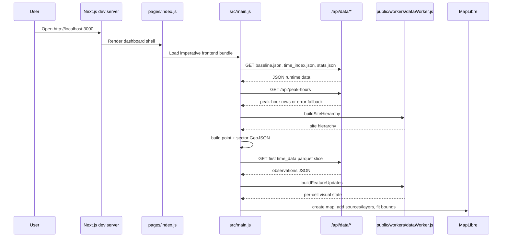
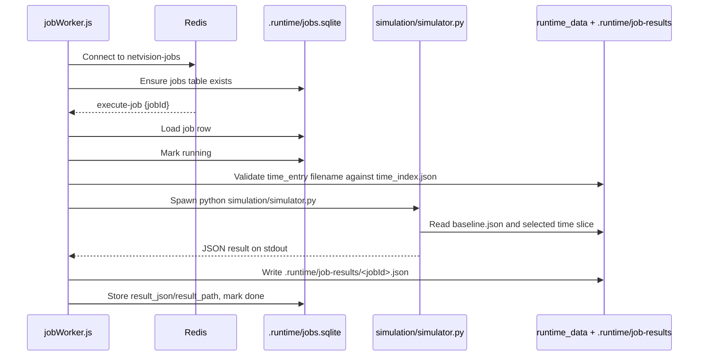
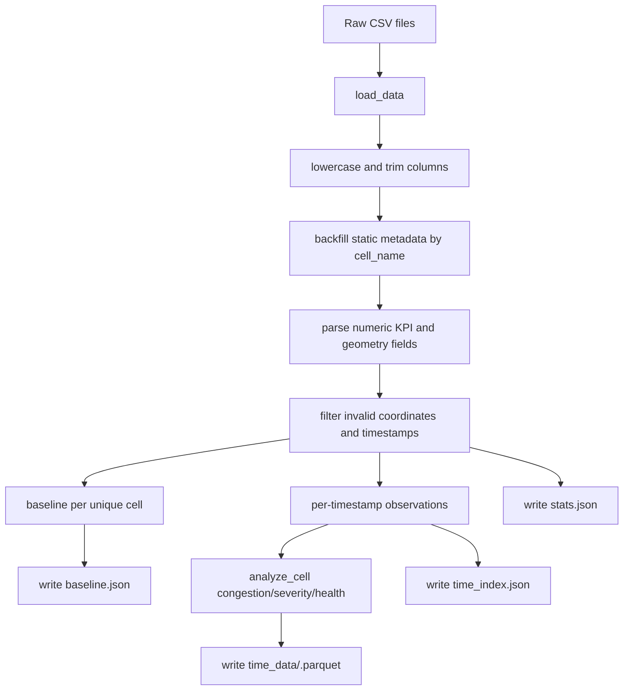
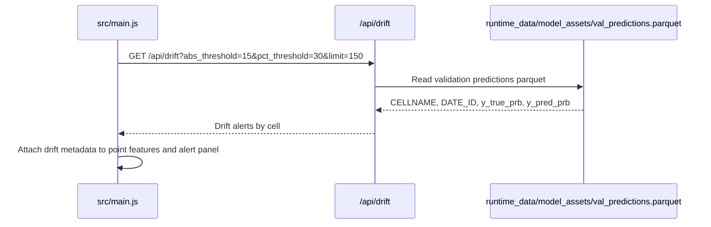
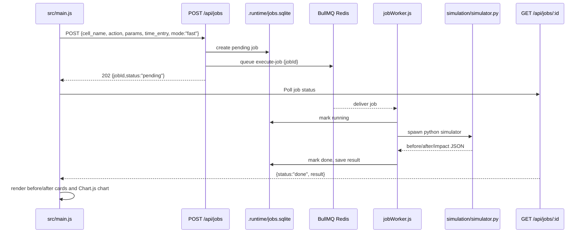
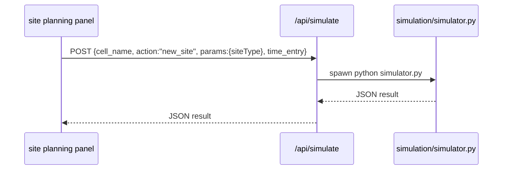
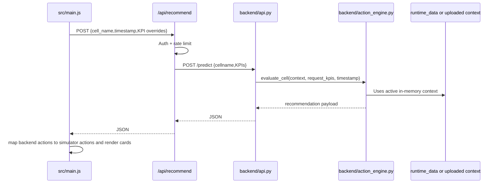
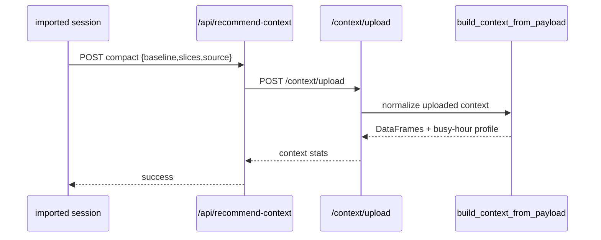
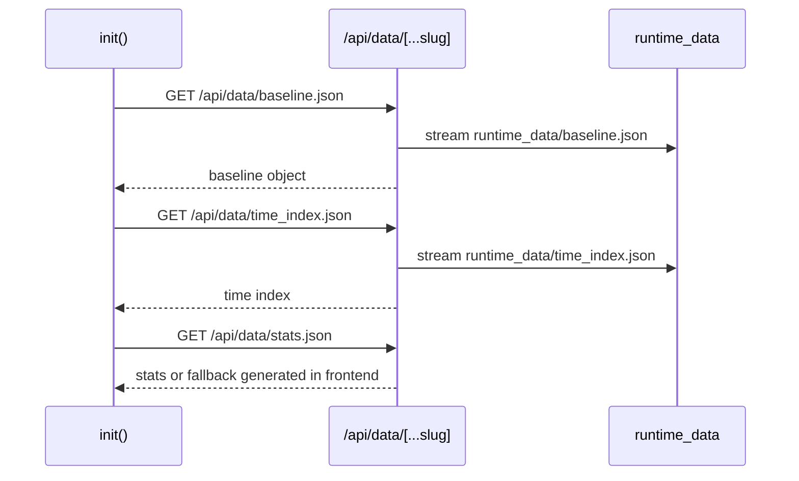
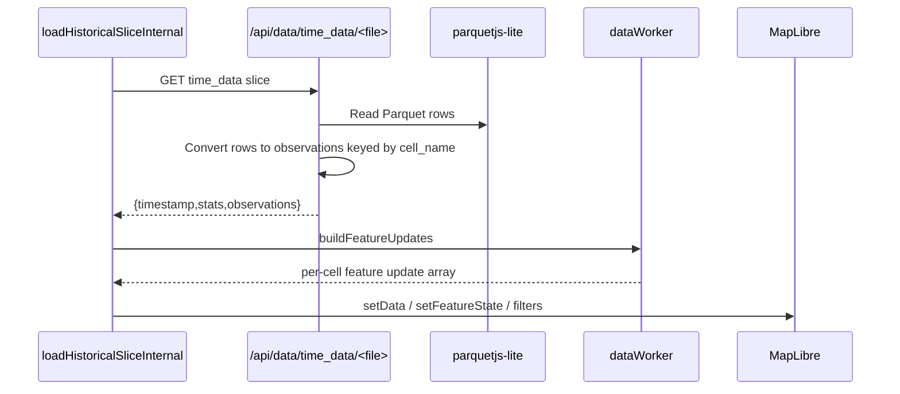

# Repo Execution Map

## A. Startup flow: `npm run dev`

`npm run dev` runs `next dev`. It starts the Next.js development server, serves `pages/index.js`, and exposes API routes under `pages/api`.



Important prerequisites:

- `node_modules/` must exist from `npm install`.
- `runtime_data/baseline.json`, `runtime_data/time_index.json`, and at least one `runtime_data/time_data/*.parquet` should exist.
- API auth is bypassed by default in non-production if no token is configured.

Current risk:

- Frontend can load local runtime data without FastAPI, but recommendations/export fail if FastAPI is down or broken.

## B. Worker flow: `npm run worker`

`npm run worker` runs `node job-workers/jobWorker.js`.



Failure path:

- Missing Redis prevents job consumption.
- Missing `simulation/simulator.py`, bad time filename, invalid payload, Python failure, or invalid JSON marks job `failed` with `error_text`.

## C. Data processing flow

Command shape:

```bash
python scripts/process_time_series.py --input data/data_set_radio_1.csv --output runtime_data
```

Script defaults differ:

```bash
python scripts/process_time_series.py --input data_set_radio_1.csv data_set_radio_all_hour.csv --output runtime_data
```



Output contracts:

- `baseline.json`: object keyed by cell name, with site, longitude, latitude, azimuth, band, local cell id.
- `time_index.json`: `{total_timestamps,start_time,end_time,storage_format,timestamps:[{timestamp,filename,stats}]}`.
- `time_data/*.parquet`: rows keyed by `cell_name` with KPI fields.
- `stats.json`: global counts and bands.

## D. Forecast flow

Current `main` has no forecast generation flow.

- No `pages/api/forecast.js` on current `main`.
- No `scripts/train_forecast_model.py` or `scripts/forecast_hf.py` on current `main`.
- README explicitly says no forecasting pipeline.
- `target/main` contains forecast files and a model artifact, but that branch is a divergent snapshot and should not be treated as current runtime behavior.

Current related flow is drift:



Current blocker:

- `runtime_data/model_assets/val_predictions.parquet` is missing locally, so `/api/drift` returns 500 and frontend falls back to no drift alerts.

## E. Simulation flow

Standard action-panel simulation uses async jobs:



Site planning flow is direct:



Supported simulator actions:

- `tilt`
- `add_carrier`
- `redistribute`
- `add_sector`
- `new_site`
- `add_site`

## F. Recommendation flow



Current blocker:

- FastAPI cannot import `backend.action_engine` in the local `.venv` because `backend/core_rules.py` lacks constants imported by `action_engine.py`.

Import-session recommendation context:



## G. Data loading flow

Baseline and index:



Time slices:



Forecast slices:

- No forecast slices are loaded on current `main`.
- Any future forecast implementation must define whether forecast slices live under `runtime_data/time_data`, `runtime_data/forecast_data`, or another allow-listed data directory; `/api/data` currently only allow-lists `time_data`.
